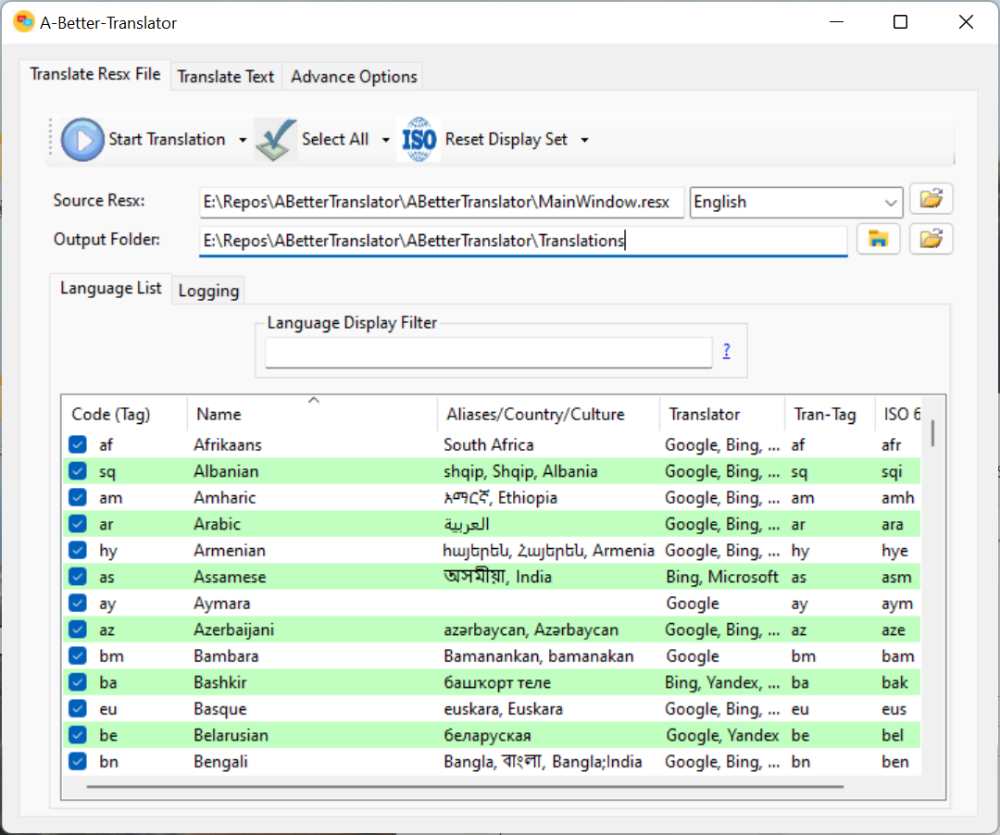

# Translates Resx Resource Files
Translates Resx files to over 160 different languages in list then 60 seconds.

## What does it do?
The GUI allows the user to select multiple languages from a list of over 160 different languages.
A file (Resx) is created for each language, with the associated language tag in the file name.
The code is optimized so that over 160 translations can take less then 60 seconds. 

# Content

[Features](README.md#Features)
-  [Filter](README.md#Filter)
-  [Sortable Language List](README.md#Sortable-Language-List)
-  [Max Threads](README.md#Max-Threads)
-  [Max Translation Len](README.md#Max-Translation-Len)
-  [Files-Per-Translation-Req](README.md#Files-Per-Translation-Req)

[Author](README.md#Author)

[License](README.md#License)

## Features

#### Filter

This option allows user to use keywords to find or filter the list to only items having the keyword(s).

#### Sortable Language List

The list view has multiple columns, and the list can be sorted by any column by clicking on the column header.

#### Max Threads

By default the programs uses the ProcessorCount to determine the maximum threads to use.  This options allows the end user to override that option.  The minimum value is 4, and the maximum value is 400.

#### Max Translation Len

The translation length is used when the program translates many files in a single translation request.  This happens if there are many files (over 100), or if the user selects option to translate many files per request.

This value is set to 10000 by default.  The minimum value is 255, and the maximum value is 10,000.

#### Files-Per-Translation-Req

This options determines if one file is used per translation request, or if many files are used per translation request. The following are the possible options to select from the combobox window.

-  [Auto]

		This is the default option. It automatically sets the best method depending on the totoal number of files to check for translation and the maximum thread settings.

-  [OnePerFile]

		Only one file is sent per translation request. This is the preferred option if the files have different languages.

-  [Many]

		Multiple files are sent per translation request. This is the perferred option if the files are all in either the source language or the target language.

## Option Window Screenshot

# Author

* **David Maisonave** - [David-Maisonave](https://github.com/David-Maisonave)

# License

-  This project is licensed under the MIT License - see the [LICENSE](LICENSE) file for details.
