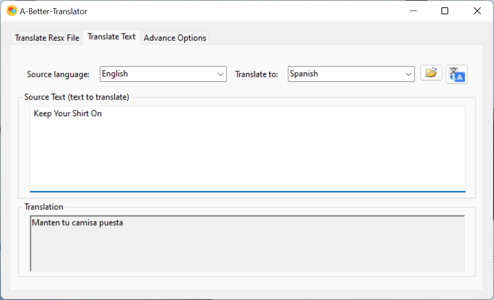
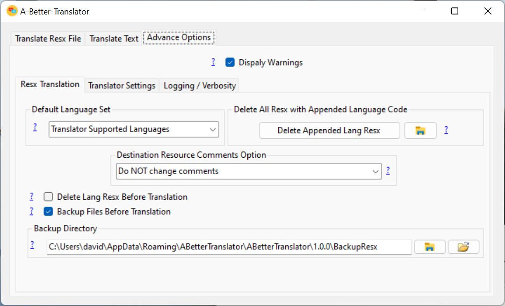
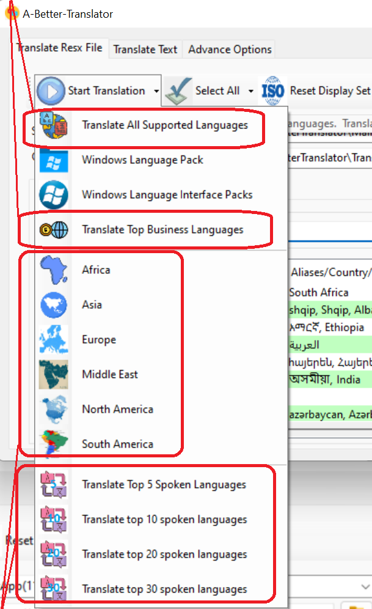
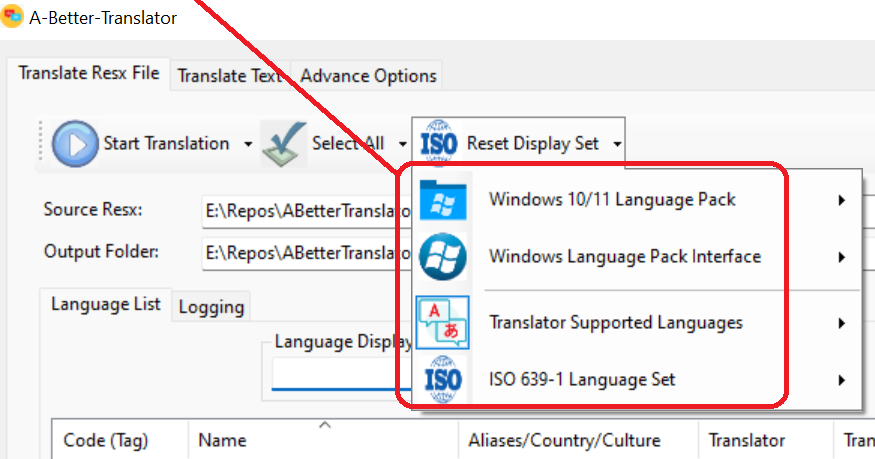
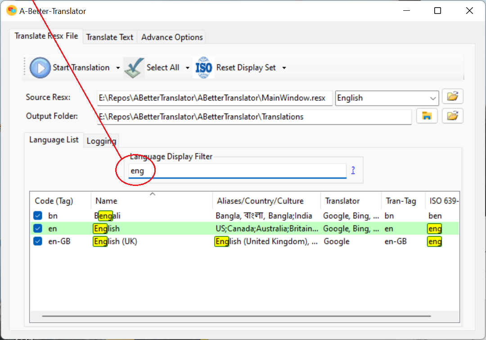
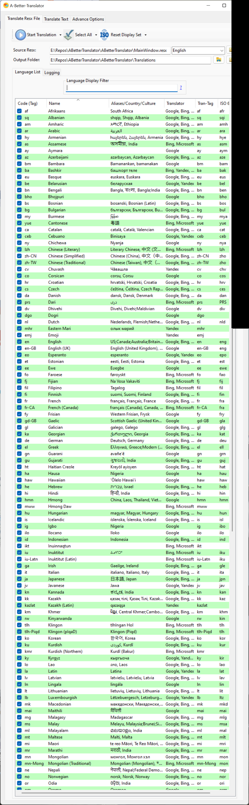

# Translates Resx Resource Files

Translates Resx files to over 130 different languages in less then 60 seconds.

## What does it do?
The GUI allows the user to select multiple languages from a list of over 130 different languages.
A file (Resx) is created for each language, with the associated language tag in the file name.
The code is optimized so that over 130 languages can be tranlsated in less then 60 seconds. 
.png)

# Content

[Features](README.md#Features)
-  [Filter](README.md#Filter)
-  [Sortable Language List](README.md#Sortable-Language-List)
-  [Max Threads](README.md#Max-Threads)
-  [Max Translation Len](README.md#Max-Translation-Len)
-  [Strings-Per-Translation-Req](README.md#Strings-Per-Translation-Req)

[Author](README.md#Author)

[License](README.md#License)

## Features

#### Filter

This option allows user to use keywords to find or filter the list to only items having the keyword(s).

#### Sortable Language List

The list view has multiple columns, and the list can be sorted by any column by clicking on the column header.

#### Max Threads

By default the programs uses the ProcessorCount to determine the maximum threads to use.  This options allows the end user to override that option.  The minimum value is 4, and the maximum value is 400.

#### Max Translation Len

The translation length is used when the program translates many strings in a single translation request.
This value is set to 10000 by default.  The minimum value is 255, and the maximum value is 10,000.

#### Strings-Per-Translation-Req

This options determines if one string is used per Resx translation request, or if many strings are used per Resx translation request. The following are the possible options to select from the combobox window.

-  [Auto]

		This is the default option. It automatically sets the best method depending on the totoal number of strings and the maximum thread settings.

-  [One]

		Only one string is sent per Resx translation request. Use this option if any of the strings contains the {next-line} character.

-  [Multiple]

		Multiple strings are sent per Resx translation request. This is the perferred option if total translation is less then 10,000 characters.

## Screenshots
### Main Tab

### Translate Text Tab 
#### This tab translates text on the fly as the user is typing.

### Advance Options Tab

### Group Language Selection
#### The user can select groups of languages based on region, popularity, and business usage.

#### The selections for top spoken languages, are based on 2022 statistics.

### Language Display Set

### Language Filter
#### The language list can displays well over 130 different languages. To help quickly find a language, the GUI has a filter field.

### Resizeable Window
#### The program window can be shrunk or expanded to user's preferred size.

# Author

* **David Maisonave** - [David-Maisonave](https://github.com/David-Maisonave)

# License

-  This project is licensed under the MIT License - see the [LICENSE](LICENSE) file for details.
